# TrialForge
## Production-Grade Multi-Tenant RAG System

Interview Demo - ML/AI Cloud Engineering Director Panel

---
layout: about-me

helloMsg: Hello!
name: Josh Phillips
imageSrc: /Pirate_Dog.png
line1: Senior Engineering Manager - AI/ML Enablement & Platform Engineering
line2: Capital One | Modern Financial Core
---

::right::

### Recent Wins
- **Production SDLC:** 8-12 days → <1 day
- **Platform Deployments:** Days → <3 hours
- **Brivo:** Led GDPR-compliant EU expansion
- **Pfizer:** Architected ML infrastructure for drug discovery

### Focus Areas
Mission-critical systems | Engineering culture | Leader development

---
layout: center
background: https://images.unsplash.com/photo-1451187580459-43490279c0fa?q=80&w=3540&auto=format&fit=crop&ixlib=rb-4.0.3
---

# The Challenge

Build a **production-grade, multi-tenant RAG system** for clinical trials

**Fully deployed to AWS:**
- CI/CD pipelines
- Security scanning  
- Compliance checks
- Monitoring & observability

---
layout: center
background: https://images.unsplash.com/photo-1451187580459-43490279c0fa?q=80&w=3540&auto=format&fit=crop&ixlib=rb-4.0.3
---

# Three Constraints

### 💰 Budget: Under $200/month
Currently at **$116/month**

### 🔒 HIPAA Compliance
Encryption, audit trails, validated controls

### 🤖 Fully Automated
No manual deployment steps

---
layout: center
---

# TrialForge Architecture

```mermaid
graph LR
    User[👤 User] -->|HTTPS| UI[Next.js<br/>Amplify]
    UI -->|JWT| Cognito[Cognito]
    UI -->|Request| APIGW[API<br/>Gateway]
    
    APIGW --> Lambda[Lambda<br/>Handler]
    
    Lambda --> Bedrock[Bedrock<br/>Titan+Claude]
    Lambda --> OpenSearch[OpenSearch<br/>Vector RAG]
    Lambda --> Letta[Letta<br/>Memory]
    
    Lambda -.->|Metrics| CW[CloudWatch]
    Lambda -.->|Traces| XRay[X-Ray]
    
    classDef frontend fill:#1a237e,stroke:#fff,color:#fff,stroke-width:2px
    classDef auth fill:#0d47a1,stroke:#fff,color:#fff,stroke-width:2px
    classDef api fill:#01579b,stroke:#fff,color:#fff,stroke-width:2px
    classDef aiml fill:#004d40,stroke:#fff,color:#fff,stroke-width:2px
    classDef ops fill:#e65100,stroke:#fff,color:#fff,stroke-width:2px
    
    class User,UI frontend
    class Cognito auth
    class APIGW,Lambda api
    class Bedrock,OpenSearch,Letta aiml
    class CW,XRay ops
```

---
layout: center
---

# Demo Approach

I'm going to answer your **five questions** by showing you the **live AWS system**

✅ **Q1: Architecture** → Real CloudFormation stacks  
✅ **Q2: Model Deployment** → Live queries + traces  
✅ **Q3: CI/CD** → Active pipelines + security gates  
✅ **Q4: Monitoring** → CloudWatch dashboards + X-Ray  
✅ **Q5: Scaling** → Lambda configs + cost breakdown  

---
layout: section
---

# Q1: Architecture
## Complex ML/AI System Design

---
layout: default
---

# Request Flow

**User makes a query:**  
"What are the inclusion criteria for heart failure trials?"

**System path:**
1. **Next.js UI** (Amplify) → User authentication via Cognito
2. **API Gateway** → JWT validation, X-Ray tracing starts
3. **Lambda ChatHandler** → Extracts tenantId from JWT
4. **Bedrock Titan v2** → Generates 1024-dim embedding vector
5. **OpenSearch** → k-NN search filtered by tenantId
6. **Bedrock Claude Haiku** → RAG synthesis with sources
7. **Letta/DynamoDB** → Saves conversation state
8. **Response** → Returns JSON with answer + citations

**Every step is traced, logged, and auditable.**

---
layout: center
background: https://images.unsplash.com/photo-1460925895917-afdab827c52f?q=80&w=3540&auto=format&fit=crop
---

# Infrastructure as Code

**100% AWS CDK (TypeScript)**
- No ClickOps
- All resources defined in code
- Version controlled
- Reproducible deployments

**Security validation:**
- `cdk-nag` blocks deployments on violations
- Compliance checks: GCP, GMLP, HIPAA, GDPR
- Automated cost estimation

---
layout: section
---

# Q2: Model Deployment
## Hands-On Experience

---
layout: section
---

# Q3: CI/CD Pipelines
## ML Workflow Automation

---
layout: section
---

# Q4: Monitoring & Alerting
## Production ML Systems

---
layout: section
---

# Q5: Scaling ML Inference
## Performance & Cost Optimization

---
layout: center
background: https://images.unsplash.com/photo-1451187580459-43490279c0fa?q=80&w=3540&auto=format&fit=crop&ixlib=rb-4.0.3
---

# What We Built

✅ **Multi-tenant RAG system** with 26,000 clinical trials indexed  
✅ **$116/month** (42% under budget)  
✅ **HIPAA controls** (encryption, audit trails, 7-year logs)  
✅ **Fully automated CI/CD** (zero manual deployment steps)  
✅ **Production observability** (CloudWatch, X-Ray, alarms)  

**As far as my wallet is concerned, this IS production.**

---
layout: cover
background: https://images.unsplash.com/photo-1682905926517-6be3768e29f0?q=80&w=3387&auto=format&fit=crop&ixlib=rb-4.0.3&ixid=M3wxMjA3fDF8MHxwaG90by1wYWdlfHx8fGVufDB8fHx8fA%3D%3D
---

# Questions?

**Live Demo Links:**
- App: https://main.d1ovxpzawsegze.amplifyapp.com
- GitHub: https://github.com/Josh-thephillipsequation/trialforge
- CloudWatch Dashboard: [Link in chat]
- X-Ray Traces: [Link in chat]
